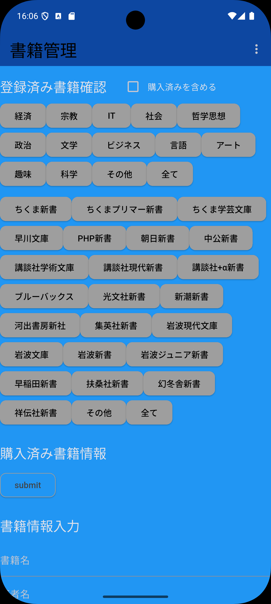

# 書籍管理アプリ by Flutter

<!--  -->
気になった本を記録する。
購入したら購入済みに分類する。

## 機能

### 初期画面

#### 登録済み書籍確認

1. 経済等のジャンル毎に登録済みの書籍の一覧を表示する
2. 出版社毎に登録済みの書籍の一覧を表示する

- ジャンル、出版社共「その他」あり
- ジャンル、出版社共全ての書籍を表示する「全て」あり。
- 「購入済みを含める」のチェックボックスをチェックすると購入済みの書籍も含めて表示される

ジャンル、出版社は固定で、追加はできません。「その他」を選択の上コメント欄に記載してください。

##### 登録済み書籍一覧 XX(XXはジャンル名か出版社名、その他、全てのいずれか)

各書籍の情報は以下の通り。

- 1行目　タイトル、出版社、購入済み(購入済みの場合)
- 2行目　ID、著者名(登録ありの場合)、ジャンル、コメント(登録ありの場合)
IDは初期登録時に自動で採番される番号です。内部的にはこの番号で管理されています。
エントリーをクリックすると「書籍情報」画面に移ります。

##### 書籍情報

以下の「書籍情報入力」を参照。

- Submitボタンで書籍情報が更新される
- Deleteボタンで書籍情報が削除される
- Go back to the Home screenボタンで初期画面に戻ります

#### 購入済み書籍情報

購入済みに分類された書籍の一覧を表示する。
右上のアイコン(︙)をクリックするとジャンル毎に購入済み書籍をリストできます。

#### 書籍情報入力

登録したい書籍に関し書籍名、著者名、出版社、ジャンル、コメントを登録します。

- 入力必須は書籍名のみです
- 出版社を選ばない場合「その他」が使われます
- ジャンルを選ばない場合「その他」が使われます

忙しい際には「書籍名」欄にタイトル、著者名、出版社名などを登録し、後から適切に更新することができます。

#### 初期画面右上アイコン

##### バックアップ

右上のアイコン(︙)をクリックすると「クリップボードへ保存」メニューがあります。これをクリックすると購入済みを含めた登録済み書籍情報がテキストでクリップボードにコピーされます。クリップボードにコピーされたデータは後で読むこませることができますのでどこかに保存しておいてください。

##### リストア

読み込ませるためには以下の手順をふみます。

1. 「クリップボードへ保存」し、どこかに保存したおいたデータをクリップボードへコピー
2. 「クリップボードから読込」を選択

読み込まれたデータは追加されます。同じタイトルの書籍が既にある場合でも追加されますので書籍名の観点では重複になります。

## システム

主なもの。

- flutter
- sqflite
